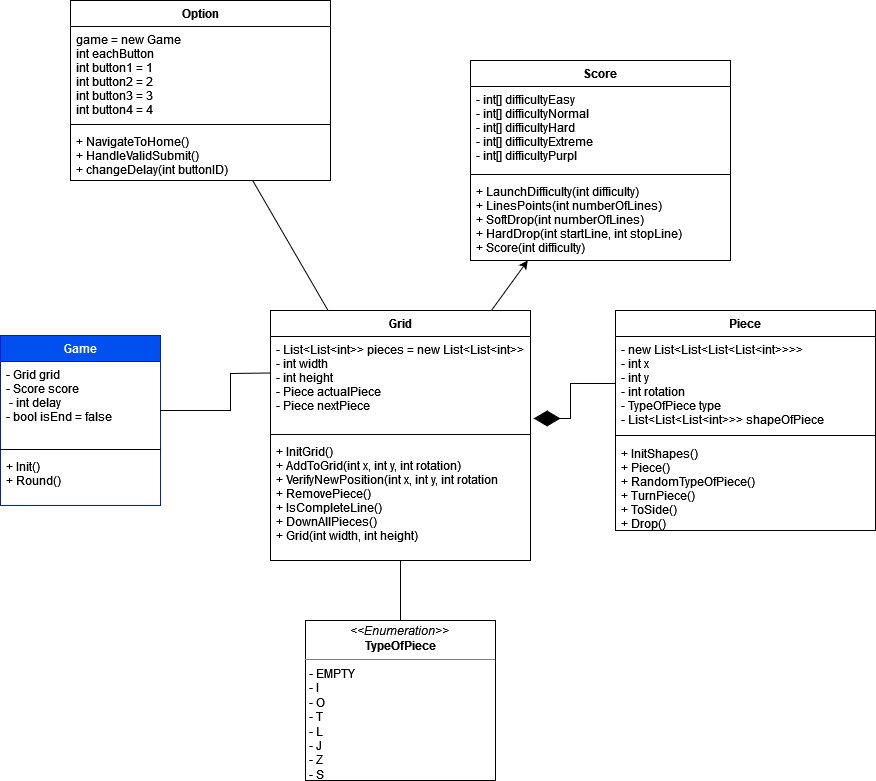

# Tetris
Le but de ce projet était la re-création du jeu Tetris en C# grâce à la technologie Blazor.

Voici un petit aperçu du rendu :

https://user-images.githubusercontent.com/73283488/161831888-d8ec2a4e-1ca7-4df8-acbd-409a13dcc9af.mp4

## :scroll: Informations

### Le jeu
Le jeu à 4 modes de difficultés : Facile, Moyen, Extrême, **Purple**:smirk:.  
La difficulté **Purple** est la plus élevé, mais elle ne donne pas forcément le plus de point :smirk:.   
Et celle par défaut est *Moyen*. 
Chaque difficulté à une musique différente !  
La taille de la grille est variable.

### Crédits
Le jeu a été créé par la team **Purpl'Studio**:punch: dans le cadre d'un **projet scolaire**.  
L'équipe est composé de : **Mathéo LEGER**, **Mattéo GRELLIER**, et **Louis BROCHARD**.  
Ce jeu est notre version du Tetris (lien du Wikipédia [ici](https://fr.wikipedia.org/wiki/Tetris)).  

### Documents

Voici quelques éléments en plus pour comprendre le projet :

- le [Figma](https://www.figma.com/file/YTk8NeWluuWcdg31YzddYX/TetrisApp?node-id=0%3A1) du projet. (Donne une idée globale du style).
- le **Diagramme de classe** (UML) :

## :joystick: Lancer le jeu
Pour lancer le jeu il faut :
- Télécharger le **repositiory** 
- L'ouvrir dans vscode
- Ouvrir un **terminale**
- Ecrire la commande ``dotnet watch run``
- Le jeu s'ouvre 🥳
**Si jamais il y a une erreur lors de premier lancement, cela est sûrement dû aux dossiers bin/ et obj/. Il suffit de relancer une deuxième fois le jeu. :wink:**

## :memo: Différence entre l'oral et le rendu

Fonctionnalités ajoutées :

- Système de difficulté, on peut choisir entre **4 difficultés** dans le **menu Option**.
- Les points des différentes actions changent en fonction de la difficulté choisie.
- On peut voir la prochaine pièce qui va tomber.
- Modification du délai : Utilisation d'une méthode appelée par le framework Blazor au démarrage du jeu, cette méthode va créer un délai qui va permettre d'effectuer les actions du jeu x temps.
- Retravaille de la rotation des pièces via le **modulo**.
